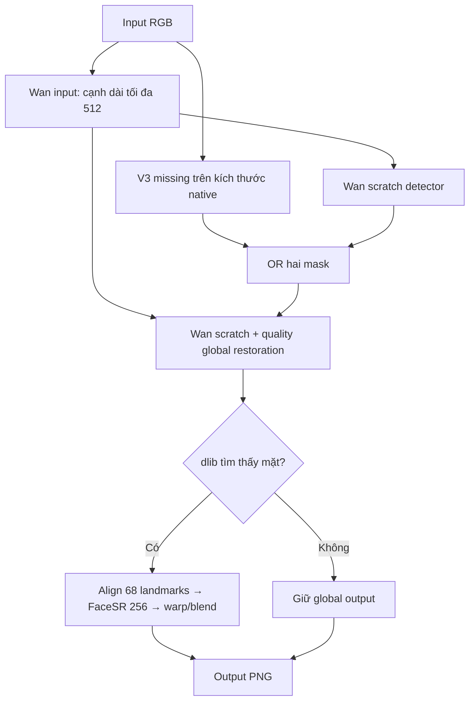

# DL2026 — Group 34 — Project 21

**Deep Restoration of Old and Damaged Photographs**

Phục hồi ảnh cũ tự động bằng **full Wan (Bringing Old Photos Back to Life) + V3 missing mask của nhóm**. Repo dành cho bài tập học thuật và chạy thử trên **Windows**, hỗ trợ laptop CPU và máy NVIDIA RTX. Không cần dataset, huấn luyện lại hoặc tự đánh mask để chạy ảnh của bạn.

## Chạy nhanh trên laptop Windows

1. Cài **Python 3.12 64-bit**, chọn **Add python.exe to PATH**; cài Git nếu chưa có.
2. Mở PowerShell tại nơi muốn lưu dự án và chạy:

```powershell
git clone https://github.com/minhphi2508/DL2026_Group34_Project21.git
cd DL2026_Group34_Project21
.\SETUP_CPU.cmd
```

3. Đợi tới `Setup complete`. Lần đầu sẽ tải thư viện và trọng số; cần Internet. Nếu có lỗi, giữ thông báo để xác định lỗi, không tiếp tục chạy khi setup chưa hoàn tất.
4. Chép ảnh vào thư mục **`inputs`**. Chạy **`RUN_RESTORATION.cmd`** bằng cách nhấp đúp.
5. Mở thư mục **`outputs\run_...\native_display`** để xem ảnh cùng kích thước ảnh gốc. Thư mục **`restored`** giữ ảnh kết quả ở kích thước xử lý của model. Tên output có tên ảnh đầu vào để dễ đối chiếu. Ảnh gốc được giữ nguyên.

Cũng có thể kéo thả **một ảnh hoặc một thư mục ảnh** lên `RUN_RESTORATION.cmd`.

## Máy Windows RTX từ đầu

1. Kiểm tra máy có driver NVIDIA hoạt động: mở Command Prompt hoặc PowerShell, chạy `nvidia-smi` và xem GPU được nhận.
2. Cài Python 3.12 64-bit và Git như phần trên. RTX 5060 Ti 16 GB có thể dùng profile CUDA 12.8 dưới đây; CUDA trên máy khác chưa được xác nhận bằng chạy thực tế trong lần bàn giao CPU.
3. Clone repo và chạy:

```powershell
git clone https://github.com/minhphi2508/DL2026_Group34_Project21.git
cd DL2026_Group34_Project21
.\SETUP_RTX.cmd
```

4. Chờ setup kiểm tra được một phép tính CUDA thật và xác minh đủ model. Chép ảnh vào `inputs`, nhấp đúp `RUN_RESTORATION.cmd`.
5. Sao lưu ảnh input, output và `RUN.json` trước khi trả máy thuê. Không cần sao lưu môi trường `.venv` nếu chỉ muốn giữ kết quả; có thể cài lại bằng repo.

Profile RTX dùng **PyTorch 2.8.0 + torchvision 0.23.0 từ kho CUDA 12.8 chính thức**. Không cần tự build dlib hoặc cài riêng CUDA Toolkit để chạy các wheel này; vẫn cần driver NVIDIA phù hợp. Xem [các bản PyTorch chính thức](https://pytorch.org/get-started/previous-versions/). Bản mặc định chọn CUDA khi khả dụng, CPU khi không có CUDA; có thể chỉ định thiết bị rõ bằng lệnh bên dưới.

## Chạy bằng lệnh

Sau setup, mở PowerShell trong repo:

```powershell
# Một ảnh, laptop CPU
.\.venv\Scripts\python.exe restore.py --input "C:\Users\YourName\Pictures\anh cu.jfif" --device cpu

# Một thư mục ảnh, máy RTX
.\.venv\Scripts\python.exe restore.py --input "C:\Photos" --device cuda

# Chọn thư mục output mới
.\.venv\Scripts\python.exe restore.py --input inputs --output "outputs\thu_lan_1" --device auto

# Kiểm tra môi trường và model
.\.venv\Scripts\python.exe doctor.py --device auto
```

`--output` là **thư mục mới**, kể cả khi chỉ chạy một ảnh. Không ghi đè kết quả cũ. Nếu bỏ `--output`, chương trình tự tạo thư mục theo thời gian. Thư mục input được đọc một cấp; không quét các thư mục con. Nếu một số file ảnh không đọc được, các ảnh hợp lệ vẫn có thể chạy và `RUN.json` ghi lỗi; thông báo hoàn tất có lỗi không có nghĩa toàn bộ batch hợp lệ.

## Định dạng ảnh

JPG/JPEG/**JFIF**, PNG và WebP được giải mã về RGB rồi đưa vào model; không chỉ đổi đuôi tên file. Các định dạng khác phụ thuộc codec Pillow đã cài. HEIC/HEIF/RAW không được cam kết hỗ trợ trong cấu hình này: xuất chúng ra PNG/JPEG trước nếu bộ đọc báo lỗi.

Ảnh động/nhiều trang chỉ dùng frame đầu. Metadata EXIF không được dùng để tự xoay ảnh; xoay ảnh đúng chiều trước khi chạy nếu cần. Transparency được chuyển về RGB, không giữ alpha trong output. Ô bàn cờ đã nằm trong pixel JPG không tự trở thành mask vùng mất. Input tối thiểu 16 pixel mỗi chiều; ảnh quá dài/hẹp có thể nằm ngoài cấu hình kích thước đã kiểm chứng.

## Pipeline cố định



- Wan scratch threshold **0.4**. Wan chuẩn hóa kích thước về bội số 16 theo mã gốc.
- V3 checkpoint **epoch 14**, chỉ dùng **head missing >=0.5**; ellipse radius **3 pixel native**, rồi PIL NEAREST về frame Wan. Không ghép head scratch V3 vào nhánh final.
- Wan global dùng `Scratch_and_Quality_restore`; mặt dùng `Setting_9_epoch_100`, crop 256, HR tắt.
- FP32, TF32 tắt; 2 luồng Torch, 1 luồng OpenCV. Không thêm C3, MAT, FFDNet hoặc Restormer vào default.
- `native_display` chỉ resize LANCZOS output về kích thước input để tiện xem, **không phải super-resolution**. Mask là hướng dẫn phục hồi; model có thể thay đổi vùng ngoài mask.

## Model và cài đặt

V3 (~98 MB) được theo dõi trực tiếp trong Git, dưới giới hạn 100 MiB/file. Các model Wan/dlib lớn được tải từ **nguồn chính thức** khi setup; SHA256 từng archive và model được kiểm tra. Chỉ giải nén các model cần cho recipe, không lấy ảnh benchmark hoặc thêm model khác. Danh sách nằm ở [`provenance/MODELS.json`](provenance/MODELS.json).

Tải archive chính thức lần đầu khoảng **2.8 GB**, ngoài thư viện Python. Model thực dùng tổng khoảng **1.23 GB**; archive tải về được giữ trong `.cache` để tiếp tục cài khi gián đoạn. Nên có ít nhất **12 GB trống cho CPU**, **20 GB cho profile RTX**, cùng dung lượng cho input/output. Thời gian cài phụ thuộc mạng; thời gian suy luận phụ thuộc CPU/GPU và kích thước native của V3. Cấu hình kiểm chứng CPU ở [`docs/VALIDATION.md`](docs/VALIDATION.md).

Chỉ kiểm tra model đã cài:

```powershell
.\.venv\Scripts\python.exe setup_models.py --verify-only
```

Sau khi mất mạng, chạy lại setup để tiếp tục `.part`. Không bỏ qua SSL/cert hoặc SHA256 khi tải lỗi. Nếu máy đã có các archive chính thức đúng hash, có thể dùng `setup_models.py --local-cache "C:\SavedModels"` để cài từ chúng.

## Output và kiểm tra chất lượng

Mỗi lần chạy có ảnh `restored`, `native_display`, mask chung, mask từng thành phần, global output, face crops nếu có, nhật ký các bước và `RUN.json`. Trạng thái `COMPLETED` chứng minh chương trình chạy xong, **không chứng minh ảnh đã được phục hồi tốt**. So sánh trước/sau, chú ý mắt, mũi, chữ, cấu trúc cảnh và vùng mất lớn.

Model có thể bỏ sót vết xước/vùng mất, làm mịn mạnh, thay đổi màu hoặc sinh lại chi tiết mặt. Ảnh bong tróc nặng vẫn có ca không đạt. dlib có thể nhận nhầm hoa văn là mặt hoặc không tìm thấy mặt bị hỏng nặng. Chưa có cam kết bảo toàn danh tính hoặc nội dung lịch sử.

## Hai yêu cầu của đề và đóng góp nhóm

1. **Phục hồi ảnh bằng deep learning:** dùng Wan pretrained để phục hồi toàn ảnh và mặt, kết hợp detector V3 của nhóm để bổ sung vùng mất.
2. **Nghiên cứu ảnh hưởng của pipeline:** so sánh các nguồn mask với cùng backend, trước/sau face refinement, và thứ tự FFDNet/Wan. Giữ cả kết quả không cải thiện và ca thất bại; không gọi pipeline này tối ưu trên mọi ảnh.

Wan pretrained thuộc tác giả Wan et al./Microsoft, **không phải model nhóm tự huấn luyện**. Nhóm đóng góp dữ liệu/sinh suy giảm, huấn luyện detector V3, tích hợp tự động, xử lý input Windows và thí nghiệm kiểm soát. V3 là U-Net/ResNet34 theo segmentation_models.pytorch, không phải kiến trúc backbone mới. Numeric gate lịch sử của V3 vẫn false; điểm benchmark của pipeline V3 + Telea cũ **không phải điểm full Wan + V3 hiện tại**.

Xem [`docs/RESEARCH.md`](docs/RESEARCH.md), [`docs/FINAL_PIPELINE.md`](docs/FINAL_PIPELINE.md), [`provenance/V3_DESCRIPTOR.json`](provenance/V3_DESCRIPTOR.json) và [`THIRD_PARTY_NOTICES.md`](THIRD_PARTY_NOTICES.md). Repo không chứa dataset hay ảnh cá nhân đã chạy development. Không dùng test benchmark để chỉnh cấu hình đóng gói.

Mã nguồn huấn luyện V3 và xây dữ liệu của nhóm được giữ riêng trong [`research_archive`](research_archive/README.md) để review đóng góp. Chúng không được chạy khi cài hoặc dùng inference; huấn luyện lại cần input packet train/val và checkpoint cha đã sao lưu riêng.

## Xử lý lỗi thường gặp

| Hiện tượng | Cách xử lý |
|---|---|
| `py`/`python` không tìm thấy | Cài Python 3.12 64-bit, chọn Add to PATH, mở lại terminal |
| CUDA unavailable / kernel không hỗ trợ | Kiểm tra driver bằng `nvidia-smi`, dùng `SETUP_RTX.cmd`; hoặc chọn CPU |
| Missing model / SHA256 mismatch | Chạy lại `setup_models.py`; giữ nguyên kiểm tra hash |
| Out of memory ở ảnh lớn | Thử CPU hoặc dùng bản input nhỏ hơn; việc đổi input có thể đổi mask/kết quả |
| Output folder exists | Chọn tên mới hoặc bỏ `--output` để tạo run mới |
| Một bước thất bại | Xem `outputs\run_...\logs` và `RUN.json`, không coi ảnh trung gian là output final |
| Ảnh chạy xong nhưng còn hư hại | Đây có thể là giới hạn detector/restoration, không nhất thiết là lỗi cài đặt |

## Nguồn và giấy phép

- [Wan et al., Bringing Old Photos Back to Life](https://arxiv.org/abs/2004.09484), [Microsoft source](https://github.com/microsoft/Bringing-Old-Photos-Back-to-Life), pinned commit `33875eccf4ebcd3665cf38cc56f3a0ce563d3a9c`.
- [Synchronized BatchNorm](https://github.com/vacancy/Synchronized-BatchNorm-PyTorch), pinned commit `7553990fb9a917cddd9342e89b6dc12a70573f5b`.
- [segmentation_models.pytorch](https://github.com/qubvel-org/segmentation_models.pytorch), [dlib](https://dlib.net/).

Upstream giữ giấy phép riêng; xem [`LICENSE.md`](LICENSE.md), [`THIRD_PARTY_NOTICES.md`](THIRD_PARTY_NOTICES.md) và [`CITATION.cff`](CITATION.cff). Không gán giấy phép MIT mới cho toàn bộ code, model và dữ liệu của nhóm.
