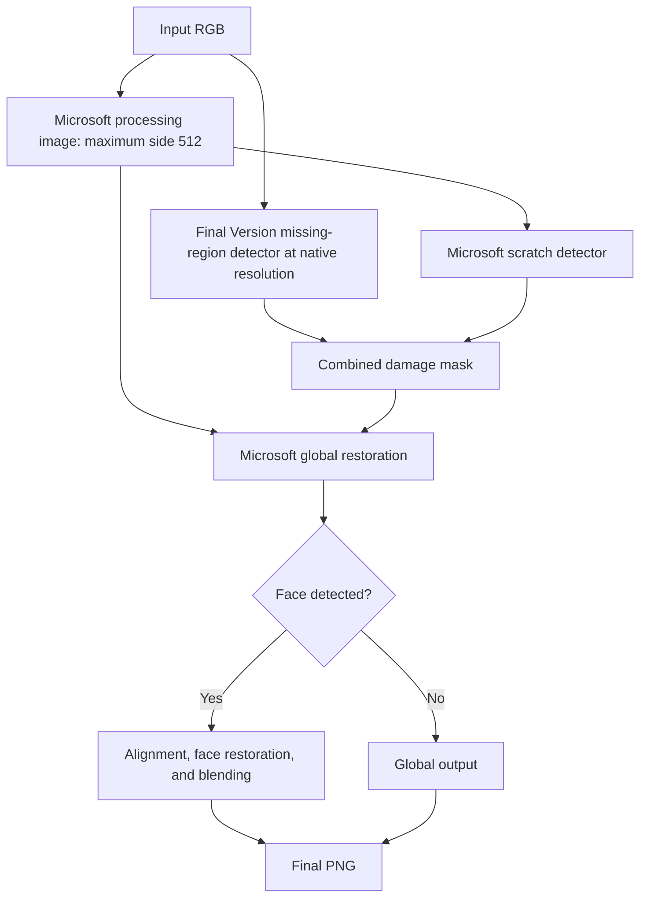

# DL2026 — Group 34 — Project 21

**Deep Restoration of Old and Damaged Photographs**

Automatic restoration using **Microsoft's Bringing Old Photos Back to Life + the group's Final Version missing-region detector**. This academic project supports **Windows CPU** and **NVIDIA RTX 5060 Ti 16 GB**. Restoring your own photographs does not require a dataset, retraining, or manual damage masks.

## Installation on Windows

Install **Python 3.12 64-bit** with **Add python.exe to PATH**, and Git. Open PowerShell:

```powershell
git clone https://github.com/minhphi2508/DL2026_Group34_Project21.git
cd DL2026_Group34_Project21
```

Choose one setup profile:

```powershell
# CPU
.\SETUP_CPU.cmd

# NVIDIA RTX 5060 Ti 16 GB: check the NVIDIA driver first
nvidia-smi
.\SETUP_RTX.cmd
```

Wait for `Setup complete`. The first setup downloads pinned dependencies and official Microsoft/dlib weights and verifies SHA256. The NVIDIA RTX 5060 Ti profile uses PyTorch 2.8.0 and torchvision 0.23.0 with CUDA 12.8 wheels. A working NVIDIA driver is required; the installer checks a real CUDA operation. A separate CUDA Toolkit installation or local dlib compilation is not required.

The completed restoration integration was verified on CPU. The NVIDIA RTX 5060 Ti profile is documented for GPU inference and detector training; full restoration inference has not been verified to match CPU pixel-for-pixel on that GPU. See [docs/VALIDATION.md](docs/VALIDATION.md).

## Restore an image or a folder

Place images in `inputs`, then double-click **RUN_RESTORATION.cmd**. You can also drag an image or a folder onto that command file, or use PowerShell:

```powershell
.\.venv\Scripts\python.exe restore.py --input "C:\Photos\old photo.jfif" --device cpu
.\.venv\Scripts\python.exe restore.py --input "C:\Photos" --device cuda
.\.venv\Scripts\python.exe restore.py --input inputs --output "outputs\example_run" --device auto
.\.venv\Scripts\python.exe tools\doctor.py --device auto
```

`--output` must be a **new directory**. Omit it to create a timestamped run automatically. Folder inputs are scanned one level only. Original files are preserved. If some recognised image files fail to decode, valid files can still run and failures are recorded in `RUN.json`.

## Input formats and outputs

JPG/JPEG/**JFIF**, PNG, and WebP are decoded into RGB; changing an extension is unnecessary. Other formats depend on installed Pillow codecs. Convert HEIC/HEIF/RAW to PNG or JPEG first. Animated and multipage files use the first frame. EXIF orientation is not applied automatically; orient images correctly before running. Output does not preserve alpha. A checkerboard baked into JPEG pixels is not an automatic missing-region mask.

Each run saves:

| Directory / file | Content |
|---|---|
| `restored` | Final PNGs at the model's processing dimensions |
| `native_display` | Display copies resized to the original input dimensions |
| `global/restored_image` | Results before face restoration |
| `masks`, `diagnostics`, `wan_masks` | Combined and component damage masks; historical internal directory names are retained |
| `faces`, `face_output` | Detected and restored face crops, when present |
| `logs`, `receipts`, `RUN.json` | Stage logs, asset verification, input/output mapping, and completion status |

`native_display` is LANCZOS resizing for viewing, not learned super-resolution. Successful execution does not establish successful restoration: inspect damage, facial features, text, object shapes, and blending boundaries against the input.

## Final pipeline



The scratch threshold is 0.4. The selected group checkpoint is epoch 14; its missing threshold is 0.5. A radius-3 elliptical margin is applied in native coordinates before nearest-neighbour mask alignment. Only the group's missing head contributes to the default combined mask. Processing uses FP32, TF32 disabled, and the published global and 256-pixel face models. Additional denoising and expanded detector fusion are experimental comparisons, not default stages.

See [docs/PIPELINE.md](docs/PIPELINE.md) and [docs/RESEARCH.md](docs/RESEARCH.md). Missing regions can remain, masks can mark healthy content, and face restoration can change details. The configuration is selected within the examined development cases rather than demonstrated optimal for every old photograph.

## Data, training, evaluation, and reproducing results

The submission includes preparation, training, evaluation, and inference source:

| Required item | Location |
|---|---|
| Dataset sources, version, splits, preprocessing, download links | [DATA.md](DATA.md) |
| Source selection and benchmark generation | [research/data_preparation](research/data_preparation/README.md) |
| Final Version training and original fixed protocol | [research/training](research/training/README.md) |
| Evaluate the selected detector | `research/evaluate_detector.py` |
| Compare mask sources and denoising placement | `research/run_experiments.py` |
| Microsoft baseline versus final pipeline and face effects | `research/compare_portraits.py` |
| Exact Windows reproduction commands and expected tables | [docs/REPRODUCIBILITY.md](docs/REPRODUCIBILITY.md) |
| Original experiment records | [docs/results](docs/results) |

The quantitative core contains 800 historical sources with a 600/100/100 split. Downloading the frozen processed package is needed for detector training/evaluation. Auxiliary scratch/noise probes for the pipeline experiments are included in the repository. Personal development portraits are not included; qualitative comparisons can use supplied images without claiming paired reference scores.

The group contributes data preparation, labelled degradation generation, detector training, mask integration, controlled component experiments, and the Windows workflow. Microsoft provides the pretrained global and face restoration models. U-Net/ResNet34 and the upstream restoration architectures are credited, not presented as new group architectures.

## Model downloads and storage

The selected detector and training initialisation checkpoint are tracked in Git. Official Microsoft/dlib archives are downloaded during setup, checked against pinned hashes, and cached in `.cache`. The first model archive download is approximately 2.8 GB; active restoration models occupy approximately 1.23 GB. Allow at least 12 GB free for CPU setup or 20 GB for the NVIDIA RTX 5060 Ti profile, plus data and outputs.

```powershell
.\.venv\Scripts\python.exe tools\setup_models.py --verify-only
.\.venv\Scripts\python.exe tools\setup_models.py --local-cache "C:\SavedModels"
```

Rerun setup after an interrupted download to resume verified `.part` files. Keep SSL and checksum checks enabled. [provenance/MODELS.json](provenance/MODELS.json) lists exact assets.

## Troubleshooting

| Symptom | Action |
|---|---|
| Python command not found | Install Python 3.12 64-bit with Add to PATH; reopen PowerShell |
| CUDA unavailable | Check `nvidia-smi` and run `SETUP_RTX.cmd` on the NVIDIA RTX 5060 Ti, or use CPU |
| Missing model or hash mismatch | Rerun `tools/setup_models.py` and preserve integrity checks |
| Out of memory | Use CPU or a smaller input; resizing can affect detections |
| Output directory already exists | Choose a new directory or omit `--output` |
| Stage fails | Inspect its log and `RUN.json`; intermediate images are not a completed result |
| Damage remains after completion | Inspect detector/restoration limitations as well as execution status |

## Repository map

| Folder | Purpose |
|---|---|
| `restoration` | Final image restoration code |
| `models` | Selected group detector weight |
| `third_party` | Pinned Microsoft source and upstream licences |
| `tools` | Installation and verification helpers |
| `research` | Data preparation, training, evaluation and experiments |
| `docs` | Pipeline, reproduction guide, findings and grouped evidence |
| `provenance` | Active model/source identities and selected configuration |
| `inputs` | Place your own images here |
| `tests`, `.github` | Input checks and Windows CI |

Start with the installation and image commands above. Training and research are optional when restoring a photograph. Detailed documents are indexed in [docs/README.md](docs/README.md).

## Attribution and licences

- [Microsoft: Bringing Old Photos Back to Life](https://github.com/microsoft/Bringing-Old-Photos-Back-to-Life), [research paper](https://arxiv.org/abs/2004.09484), source commit `33875eccf4ebcd3665cf38cc56f3a0ce563d3a9c`.
- [Synchronized BatchNorm](https://github.com/vacancy/Synchronized-BatchNorm-PyTorch), source commit `7553990fb9a917cddd9342e89b6dc12a70573f5b`.
- [segmentation_models.pytorch](https://github.com/qubvel-org/segmentation_models.pytorch), [dlib](https://dlib.net/), and [KAIR / FFDNet](https://github.com/cszn/KAIR).

See [LICENSE.md](LICENSE.md), [attribution](docs/ATTRIBUTION.md), and [CITATION.cff](CITATION.cff). Source licences and author credits are preserved. Frozen evidence and internal path identifiers retain provenance; they are not the public component name.
